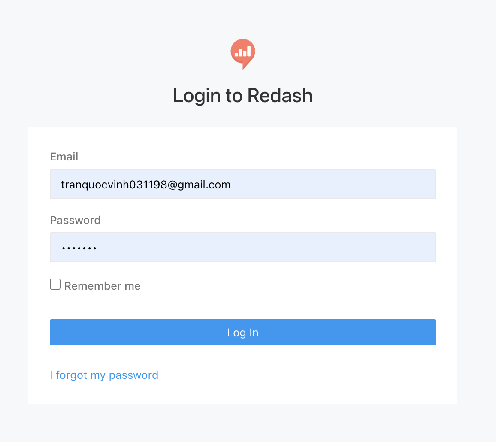
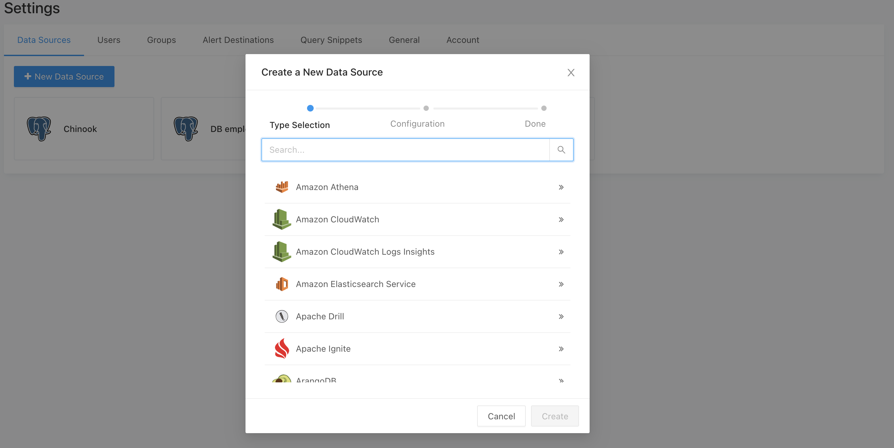
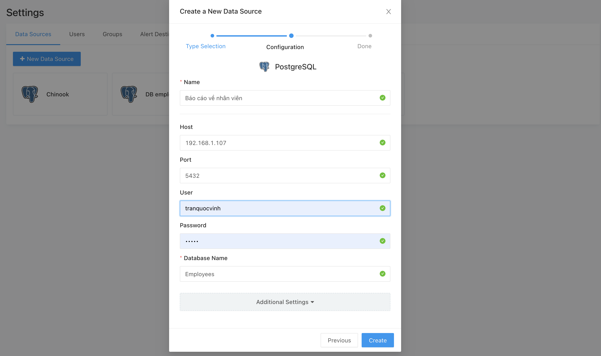
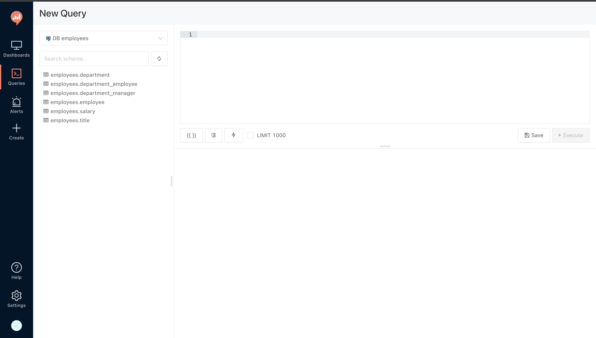
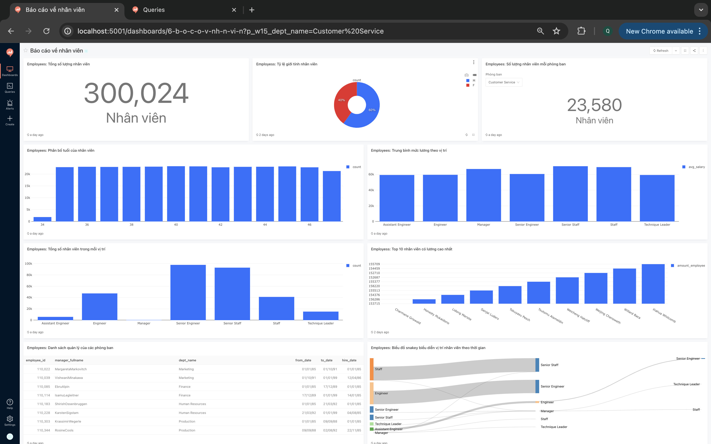

# Business-Intelligence-Dashboard

## Cài đặt REDASH - TOOL VISUALIZE

### Cài đặt Redis
* curl -fsSL https://packages.redis.io/gpg | sudo gpg --dearmor -o /usr/share/keyrings/redis-archive-keyring.gpg
* echo "deb [signed-by=/usr/share/keyrings/redis-archive-keyring.gpg] https://packages.redis.io/deb $(lsb_release -cs) main" | sudo tee /etc/apt/sources.list.d/redis.list
* sudo apt-get update
* sudo apt-get install redis
* Tham khảo: https://www.digitalocean.com/community/tutorials/how-to-install-and-secure-redis-on-ubuntu-22-04

### Cài đặt Database
B1: Cài đặt database postgresql cho ubuntu 20.04
* sudo sh -c 'echo "deb http://apt.postgresql.org/pub/repos/apt $(lsb_release -cs)-pgdg main" > /etc/apt/sources.list.d/pgdg.list'
* sudo wget --quiet -O - https://www.postgresql.org/media/keys/ACCC4CF8.asc | sudo apt-key add -
* sudo apt-get update
* sudo apt-get -y install postgresql-14
* Tham khảo: https://www.digitalocean.com/community/tutorials/how-to-install-postgresql-on-ubuntu-20-04-quickstart

B2: Tạo database `redash`
* sudo -u postgres psql
* CREATE DATABASE redash;
* CREATE USER admin WITH PASSWORD 'admin123456';
* GRANT ALL PRIVILEGES ON DATABASE redash TO admin;

### Cài đặt redash (môi trường test)
B1: Tạo/sửa file môi trường .env

* Địa chỉ database, địa chỉ redis theo mẫu: ipconfig getifaddr en0
* Database: `postgresql://***:*****@*******:5432/redash`
* Redis: `redis://*********:6379/0`

B2: Tạo image redash sử dụng dockerfile (đã tạo)

* docker build -t redash:version2 -f Dockerfile .

B3: Tạo bảng trong database `redash` (đã tạo)

* docker-compose run --rm server create_db

B4: Chạy redash:

* docker-compose up

B4.2: Stop
* docker-compose down

B5: Địa chỉ giao diện redash: ip:5001

### Các lỗi thường gặp trong cài đặt

Lỗi 1: Không kết nối được database đã tạo (port: 5432).
* `sudo vim /etc/postgresql/14/main/postgresql.conf`
* sửa `listen_addresses = "*"`
* `sudo vim /etc/postgresql/14/main/pg_hba.conf`
* khai báo `host: 0.0.0.0/0 md5`

Lỗi 2: Không kết nối được redis (cannot connect redis refuse)
* `sudo service redis-server status`
* `sudo vim /etc/redis/redis.conf`
* sửa `supervised systemd`
* Lưu ý: Có thể cài đặt redis bằng docker

### Dashboard Demo
Đăng nhập vào localhost

Bật pgadmin

Tạo data soure

Liên kết với database

Truy cập query

Truy cập dashboards

